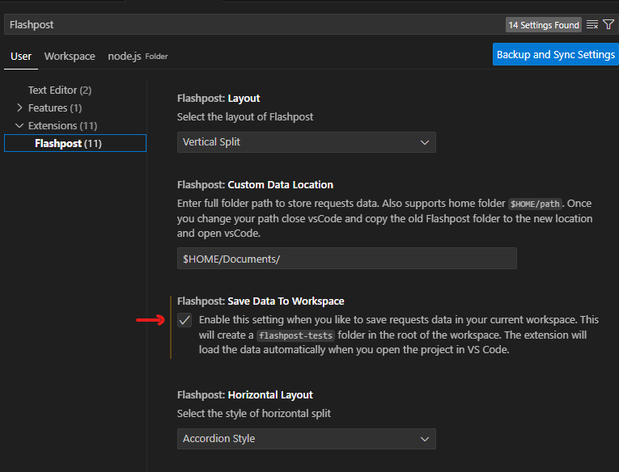

# How to configure
1. Run Visual Studio Code.
1. Open `node.js.code-workspace`.
1. Install [`Flashpost`](https://marketplace.visualstudio.com/items?itemName=VASubasRaj.flashpost) extension by Subas Raj.
1. Configure the extension.
1. Enable `Save Data To Workspace`.
   

# How to use
