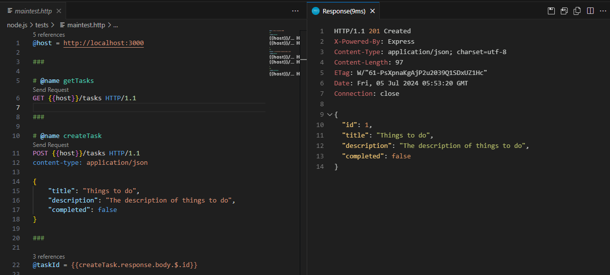
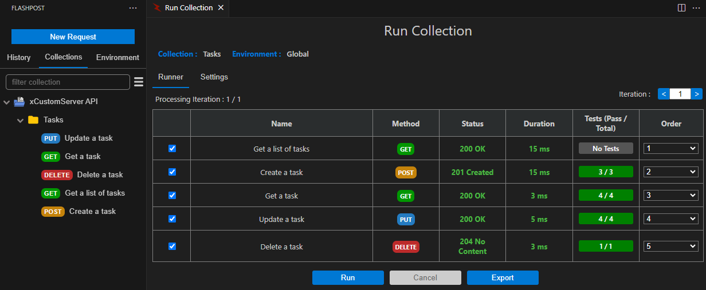
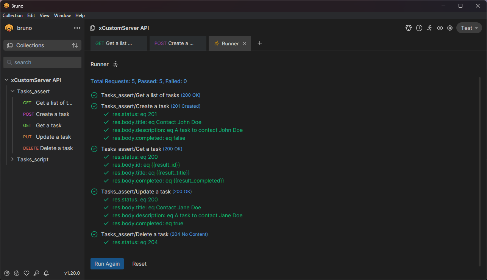

# Introduction
This repository is an example to automatic generate OpenAPI documentation (see https://swagger.io/specification/).

# Sample servers
Sample servers are provided, placed in folders with the format, `server-[package]`, where the `[package]` represent the library used to perform the OpenAPI documentation generation.

- `server`
  - Plain server without OpenAPI documentation package.
- `server-swagger-jsdoc`
  - https://github.com/Surnet/swagger-jsdoc
- `server-tspec`
  - https://github.com/ts-spec/tspec

# Swagger UI

*Swagger UI*

*OpenAPI Documentation - json*

# Test Tools
## Rest Client Extension for Visual Studio

*Rest Client .html file and HTTP request result*

REST Client (https://github.com/Huachao/vscode-restclient) allows you to send HTTP request and view the response in Visual Studio Code directly. It eliminates the need for a separate tool to test REST APIs and makes API testing convenient and efficient.

.http test scripts are located in ./tests

## Flashpost

*Flashpost Test Runner*

Flashpost (https://github.com/subasraj/flashpost-support/tree/main), a VS Code extension enables you to develop and test your REST APIs directly from Visual Studio Code.

Flashpost test scripts are located in ./Flashpost-tests

## Bruno

*Bruno Test Runner*

*Bruno Test Report - Summary (html)*

*Bruno Test Report - Requests (html)*

Bruno (https://www.usebruno.com/) is a Fast and Git-Friendly Opensource API client, aimed at revolutionizing the status quo represented by Postman, Insomnia and similar tools out there.

Bruno test scripts are located in ./tests/bruno

# Endpoints

| Endpoint                                | Description                   |
| ---                                     | ---                           |
| http://localhost:3000                   | Hello world                   |
| http://localhost:3000/form              | Form page                     |
| http://localhost:3000/fetchDemo/server  | Performs a fetch from server  |
| http://localhost:3000/fetchDemo/client  | Performs a fetch from client  |
| http://localhost:3000/tasks             | Tasks API                     |
| http://localhost:3000/api-docs          | OpenAPI Documentation         |
