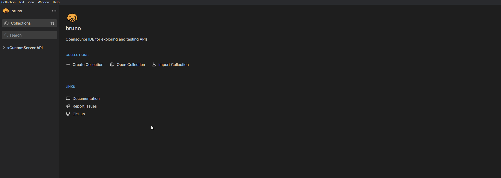
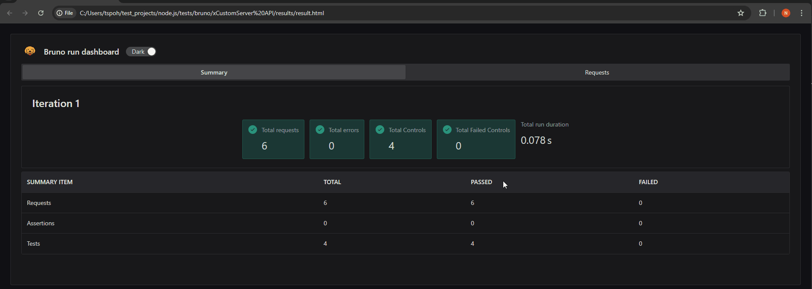

# Installation
1. Download bruno from https://www.usebruno.com/downloads.

# Load workspace
1. Run bruno.
1. Click Collection->Open Collection.
1. Browse to `./tests/bruno/xCustomServer API` and click `Select Folder`

# How to use

# Run test and generate report via bruno cli
Execute `bru run [test folder name] --env [environment name] -o [report path] --f html`

Example,
`bru run Tasks_script --env test -o ./results/result.html --f html`

